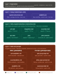

# Copilot spec-driven development setup

This repository contains the GitHub Copilot instruction architecture for spec-driven development.
Read this before touching any file in `.github/`.

---

## How the system works

All feature development follows a four-phase workflow enforced by Copilot:

```
PLAN → REVIEW → REFINE → EXECUTE
```

The workflow is defined in `AGENTS.md`. Every agent session reads that file first.

---

## File structure

```
.
├── AGENTS.md                          ← Workflow rules + instruction routing map
├── specs/                             ← One spec file per JIRA ticket
│   └── JIRA-EXAMPLE.md               ← Example spec showing the template
└── .github/
    ├── copilot-instructions.md        ← Always loaded: stack, package structure, hard rules
    ├── instructions/
    │   ├── testing/
    │   │   ├── unit-test.instructions.md          ← Auto-loaded for *Test.kt
    │   │   ├── integration-test.instructions.md   ← Auto-loaded for *IT.kt
    │   │   └── cucumber-bdd.instructions.md       ← Auto-loaded for *.feature + steps
    │   └── backend/
    │       ├── api-rules.instructions.md          ← Auto-loaded for controller/**
    │       └── jooq.instructions.md               ← Auto-loaded for repository/**
    ├── skills/
    │   ├── unit-test/SKILL.md         ← Examples + templates for unit tests
    │   ├── integration-test/SKILL.md  ← Examples + templates for integration tests
    │   ├── cucumber-bdd/SKILL.md      ← Examples + templates for BDD
    │   ├── jooq/SKILL.md             ← DSL patterns + query examples
    │   └── api-rules/SKILL.md        ← Controller templates + response examples
    ├── prompts/
    │   ├── plan-jira.prompt.md        ← Invoke to start the PLAN phase
    │   ├── refine-spec.prompt.md      ← Invoke during REVIEW/REFINE
    │   └── execute.prompt.md          ← Invoke to start EXECUTE phase
    └── chatmodes/
        ├── plan.chatmode.md           ← Specialist mode: planning only, no code
        └── execute.chatmode.md        ← Specialist mode: implementation only
```

---

## Layer responsibilities

| Layer | Files | Purpose | Contains |
|-------|-------|---------|---------|
| Always-on | `copilot-instructions.md`, `AGENTS.md` | Universal rules and workflow | Rules only. No examples. |
| Path-scoped | `*.instructions.md` | Auto-loaded rules per file type | Rules only. No examples. |
| On-demand | `skills/*/SKILL.md` | Examples, templates, patterns | Code examples, real patterns from the codebase |
| Explicit | `prompts/*.prompt.md` | Phase invocation | Structured prompts for each workflow phase |
| Mode | `chatmodes/*.chatmode.md` | Specialist personas | Tool restrictions + focused instructions per phase |

**The single most important rule:** Nothing lives in two places. Rules in instructions, examples in skills. No duplication.

---

## How to use this day-to-day

### Starting a new feature

1. Open Copilot Chat in `plan` chat mode (or use `/plan-jira` prompt)
2. Paste the JIRA ticket description
3. Answer any clarifying questions Copilot asks
4. Review the generated spec file in `specs/`

### Refining the spec

1. Read the spec file
2. Use `/refine-spec` prompt or switch to a regular chat and describe what to change
3. Confirm changes when Copilot summarises them

### Executing

1. With the spec approved, use `/execute` prompt or switch to `execute` chat mode
2. Copilot will work through the checklist in order, ticking items off as it goes
3. Review the PR — the spec file is the reference document for the review

---

## How to fill in this skeleton

Every file in `.github/` contains `[REPLACE: ...]` markers. Work through them in this order:

1. **`copilot-instructions.md`** — fill in your actual stack versions, package structure, and hard rules
2. **`AGENTS.md`** — the workflow is already written; update the commit convention prefix if needed
3. **`instructions/`** — fill in your specific conventions for each file type (naming, annotations, anti-patterns)
4. **`skills/*/SKILL.md`** — paste real examples from your codebase; these are the most valuable files once filled in
5. **`prompts/`** — these are ready to use; adjust phrasing if needed
6. **`chatmodes/`** — ready to use; add tools if your setup requires more

---

## Maintenance

- When a new convention is introduced, update the relevant `.instructions.md` file in the same PR.
- When a new pattern is established, add an example to the relevant `SKILL.md` file.
- Spec files in `specs/` are permanent records — never delete them.
- Review all instruction files quarterly or after any major framework upgrade.


git initbrew install git